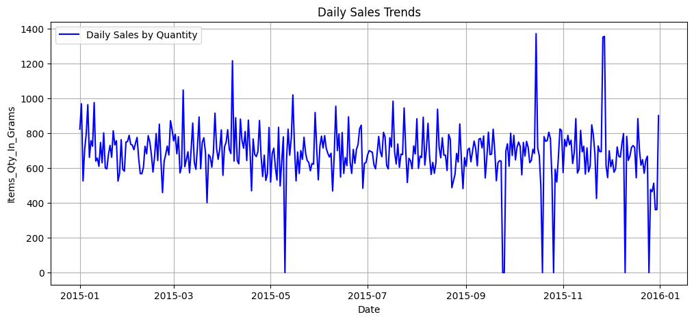
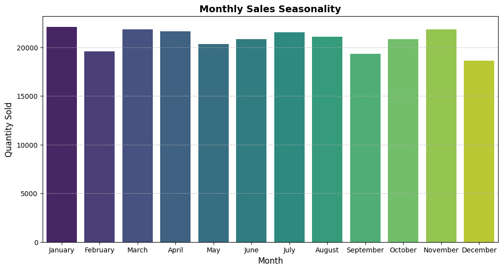
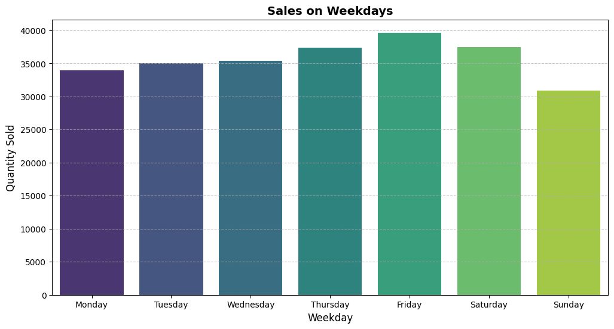

<h1 align="center">📊 Analysis Report 📊</h1>

## 📊 Daily Sales by Quantity
Gain insights into daily sales trends with the following visualization:

---

## 📆 Monthly Sales of Quantity (in Grams)
Track the sales quantity in grams on a monthly basis:

---

## 📉 Monthly Sales Seasonality
Understand seasonal trends in monthly sales:

---

## 📅 Weekly Sales
Observe weekly fluctuations in sales data:

---

## 📅 Weekday vs. Weekend Sales
Compare sales performance on weekdays versus weekends:

---

## 🥗 Top 10 Ingredients by Total Quantity Used
Discover the most used ingredients in terms of quantity:

---

### 📌 Summary
This report provides key insights into sales trends based on daily, weekly, and monthly data, highlighting seasonal fluctuations and ingredient consumption patterns. These visualizations serve as a foundation for data-driven decision-making.
