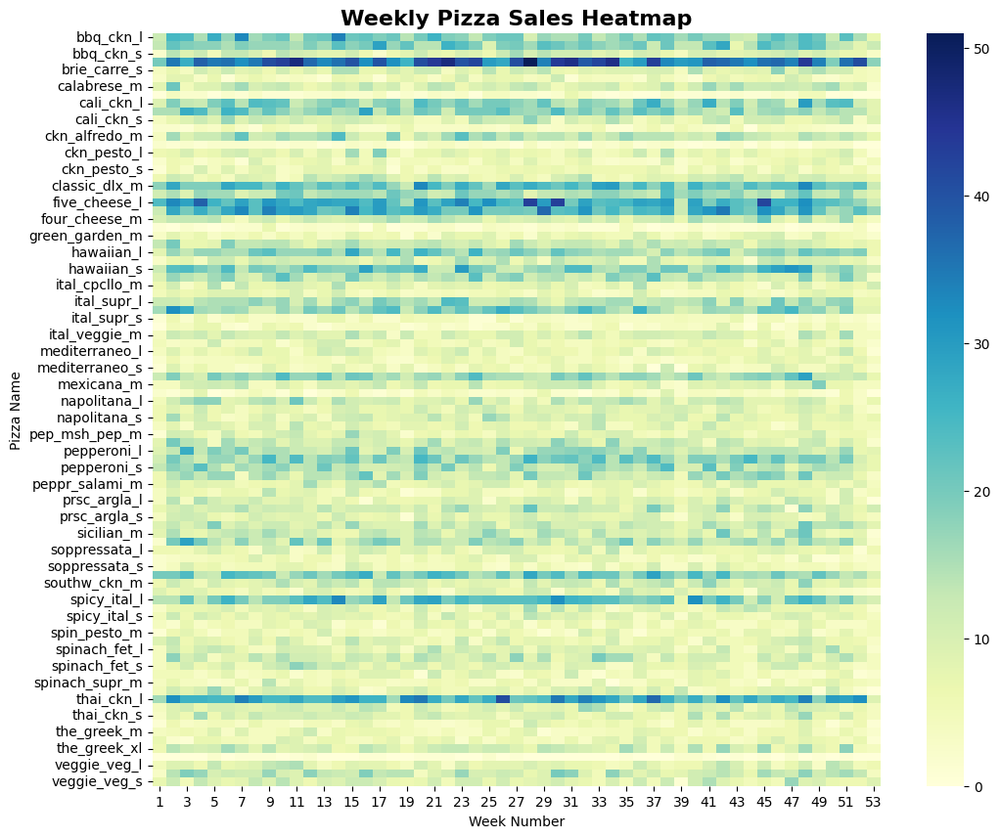

<h1 align="center">📊 Analysis Report 📊</h1>

## Weekly Sales Trend (Line Chart)
- **Use**: Visualize the trend of weekly sales over time.
- **Comment**: This line chart helps in identifying patterns and fluctuations in weekly sales.
  
.png)

---
## Weekly Sales Trend (Bar Chart)
- **Use**: Compare weekly sales figures side by side.
- **Comment**: The bar chart provides a clear comparison of sales volume for each week.

.png)

---
## Heatmap
Quickly spot which pizzas have high/low sales in each week:
- **Use**: Identify the popularity of different pizzas over time.
- **Comment**: The heatmap highlights the best and worst-selling pizzas each week.

---
## Weekly Sales with Rolling Mean
Quickly spot which pizzas have high/low sales in each week:
- **Use**: Analyze sales trends with a rolling mean to smooth out short-term variations.
- **Comment**: This chart combines weekly sales data with a rolling mean for better trend analysis.

---
## Top 10 Pizzas by Total Quantity Used
Quickly spot which pizzas have high/low sales in each week, hides all other pizzas:
- **Use**: Focus on the top-performing pizzas in terms of quantity sold.
- **Comment**: This chart highlights the top 10 pizzas, making it easier to identify the most popular items.

---
### 📌 Summary
This report provides key insights into sales trends based on daily, weekly, and monthly data, highlighting seasonal fluctuations and ingredient consumption patterns. These visualizations serve as a foundation for data-driven decision-making.

