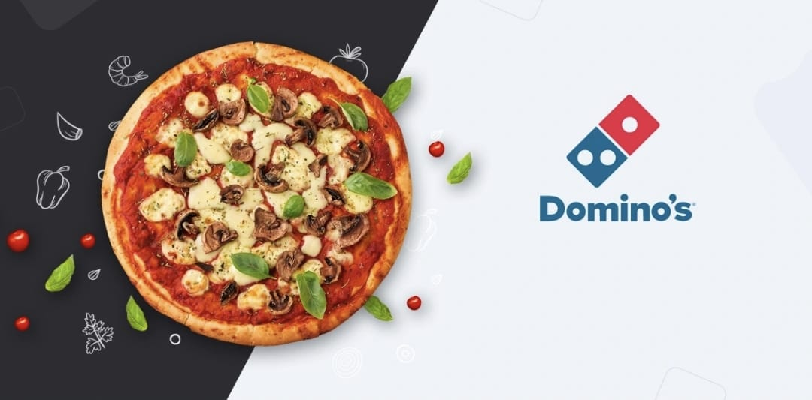

<h1 align="center">🍕Dominos - Predictive Purchase Order System🍕</h1>




<h2>Table of Contents</h2>

- [📖**Project Description**](#project-description)
- [🧑‍💼**Business Use Cases**](#business-use-cases)
- [📁**Data Set Explanation**](#data-set-explanation)
- [🚩**Approach**](#how-to-approach-this-project)

## 📖Project Description

Dominos wants to optimize the process of ordering ingredients by predicting future sales and creating a purchase order. By accurately forecasting sales, Dominos can ensure that it has the right amount of ingredients in stock, minimizing waste and preventing stockouts. This project aims to leverage historical sales data and ingredient information to develop a predictive model and generate an efficient purchase order system.

## 🧑‍💼Business Use Cases

1. **Inventory Management:** Ensuring optimal stock levels to meet future demand without overstocking.
2. **Cost Reduction:** Minimizing waste and reducing costs associated with expired or excess inventory.
3. **Sales Forecasting:** Accurately predicting sales trends to inform business strategies and promotions.
4. **Supply Chain Optimization:** Streamlining the ordering process to align with predicted sales and avoid disruptions.

## 📁Data Set Explanation

**Sales Data:** Historical sales records (Date, Pizza Type, Quantity Sold, Price, Category, Ingredients)
**Ingredient Data:** Ingredient requirements for each pizza type (Pizza Type, Ingredient, Quantity Needed)

- You can download these datasets from here : [**Datasets**](https://www.kaggle.com/datasets/avijitjana101/dominos-predictive-purchase-order-system)

## How to Approach this Project

- Checkout the Step by Step process to understand using this: [**Approach file**](https://github.com/Avijit-Jana/Dominos-Predictive_Purchase_Order_System/blob/main/Approach.md)

- Check out the [**Sales Reporting**](https://github.com/Avijit-Jana/Dominos-Predictive_Purchase_Order_System/blob/main/Analysis_Report.md)
- **Install Dependencies:** Ensure you have Python 3.7 or higher installed. Then, install the required Python packages using:

```bash
pip install -r requirements.txt
```

- Run the Streamlit Application: Start the Streamlit app with the following command:

```bash
python -m streamlit run Output/app.py
```

<h3 align="middle">Developed By - Avijit Jana</h3>